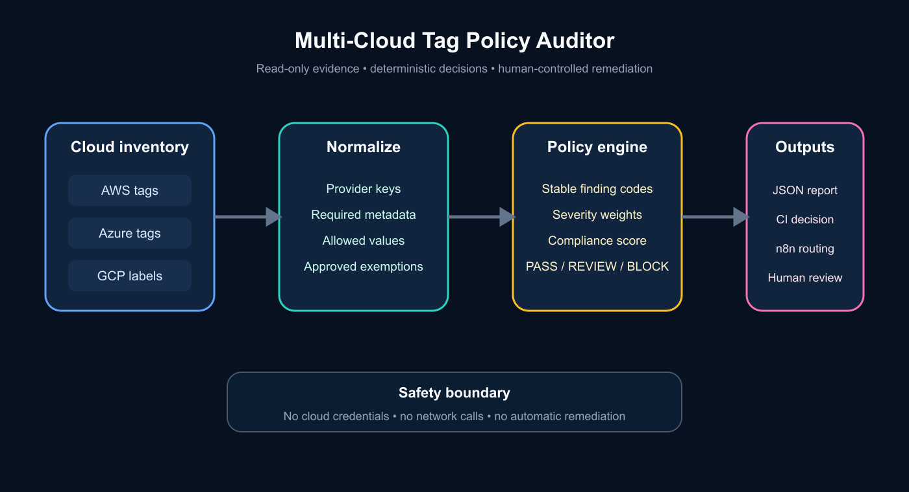

# Multi-Cloud Tag Policy Auditor

Day 6 of Jeffrey Ikuoyemwen's Cloud + AI portfolio series.

Cloud cost and operational ownership become difficult to defend when AWS tags, Azure tags, and Google Cloud labels use inconsistent names or omit critical metadata. This project turns a multi-cloud resource inventory into a deterministic compliance decision without changing any cloud resource.



## What it demonstrates

- Provider-aware normalization across AWS, Azure, and Google Cloud.
- Policy-as-code for ownership, cost allocation, environment, and data-classification metadata.
- Explainable `PASS`, `REVIEW`, or `BLOCK` decisions with stable finding codes.
- Deterministic JSON output suitable for CI, n8n, dashboards, or an AI explanation layer.
- Human approval boundaries: the auditor recommends action but never writes tags.

## Architecture

1. Export a read-only resource inventory from one or more cloud providers.
2. Normalize provider-specific tag and label keys.
3. Evaluate the inventory against an explicit policy.
4. Produce an auditable report and route non-compliant resources for review.

The decision path is deterministic. An LLM may summarize the report later, but it cannot change the underlying verdict.

## Run locally

Python 3.11 or newer is recommended. The core runtime has no third-party dependencies.

```bash
python -m pip install -e .
multi-cloud-tag-audit examples/resources.json
```

The CLI returns exit code `0` for `PASS`, `1` for `REVIEW`, and `2` for `BLOCK`, making it useful as a CI quality gate.

## Run the tests

```bash
python -m unittest discover -s tests -v
```

## Run with Docker

```bash
docker build -t multi-cloud-tag-policy .
docker run --rm -v "$PWD/examples:/data:ro" multi-cloud-tag-policy /data/resources.json
```

The example mounts input read-only. The container contains no cloud credentials and performs no network calls.

## Input contract

```json
{
  "policy": {
    "required_tags": ["owner", "cost_center", "environment", "data_classification"],
    "allowed_environments": ["dev", "test", "stage", "prod"],
    "exempt_resource_types": ["aws:iam:service-linked-role"]
  },
  "resources": [
    {
      "provider": "aws",
      "resource_id": "arn:aws:ec2:us-east-1:123456789012:instance/i-012345",
      "resource_type": "aws:ec2:instance",
      "tags": {
        "Owner": "platform@example.com",
        "Cost-Center": "CC-1042",
        "Environment": "prod",
        "Data Classification": "internal"
      }
    }
  ]
}
```

## Safe deployment guidance

- Generate inventories with read-only cloud roles.
- Store policy files in version control and require pull-request review for changes.
- Run the auditor in CI or on a schedule before adding any remediation workflow.
- Route `BLOCK` and `REVIEW` reports to a named owner.
- Keep remediation separate and require explicit human approval before changing tags.
- Never place credentials, account secrets, or sensitive tag values in sample data or logs.

## Optional n8n workflow

[`n8n/tag-policy-review-workflow.json`](n8n/tag-policy-review-workflow.json) shows a safe review pattern: receive a completed audit report, classify the deterministic decision, and prepare a review notification. Credential nodes and autonomous cloud-write steps are intentionally absent.

## Repository structure

```text
src/multi_cloud_tag_policy/  Deterministic policy engine and CLI
tests/                       Unit tests
examples/                    Synthetic multi-cloud inventory
docs/                        Architecture assets
n8n/                         Optional review-routing workflow
.github/workflows/           Continuous integration
social/                      Medium, LinkedIn, and learning notes
```

## Limitations

This is a portfolio reference implementation. It consumes exported inventory JSON; it does not query live cloud accounts, infer tag ownership, or remediate resources.

